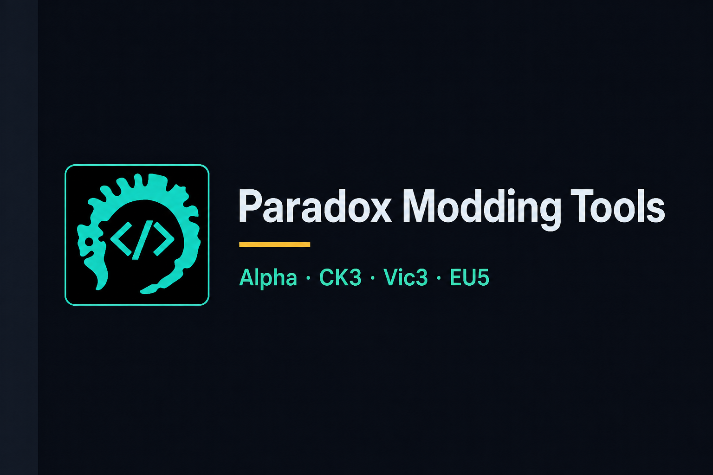

**My Discord User:** https://discord.com/users/168438474905616386

# Paradox Modding Tools



Desktop workspace for **Crusader Kings III**, **Victoria 3**, and **Europa Universalis V** (partial) modders. One workspace is one game install plus the mods you are editing: script-aware IDE, event graph, compatibility and loc health, wiki patch notes, and Steam Workshop / Paradox Mods publish.

**Alpha.** Expect bugs. **Windows and Linux** (traditional desktop distros). **macOS is not supported.**

[Download](https://github.com/idodavis/paradox-modding-tools/releases) · [Docs](https://idodavis.github.io/paradox-modding-tools/) · [License](LICENSE)

Unofficial. Not affiliated with Paradox Interactive. Licensed **GPL-3.0-or-later**.

## What's in the app

| Page | What it does |
|------|----------------|
| **Library** | Workspaces by game; open / edit / delete the PMT record; New Workspace / New Mod; Reset all data |
| **Create Workspace** | Game → install (detect/add, version pin / `latest`) → mods + load order → name |
| **Workspace IDE** | monaco-vscode workbench; PMT-owned roots; game files read-only; Guide wiki pane |
| **Event Graph** | Live-session harvest; origin groups; Open from IDE hover |
| **Workspace Health** | FIOS/LIOS contests, overlays, depends, dangling refs, loc missing/orphan/untranslated |
| **Patch Center** | Cached wiki patch notes |
| **Publish** | Descriptor + Markdown/BBCode, Steam Workshop (embedded helper), Paradox Mods copy-paste |
| **Workspace Settings** | Name, loc language, remember tabs, default tool, install, mods, Workshop ignore |
| **Display** | Header popover: theme family, scale, fonts, visible tools |

## Supported games

| Game | Coverage |
|------|----------|
| Crusader Kings III | Script, loc, events, health, Guide, publish |
| Victoria 3 | Same |
| Europa Universalis V | **Partial** — stage roots and `INJECT:` / `REPLACE:` |

## Supported OS

| OS | Notes |
|----|--------|
| **Windows** 10 / 11 | amd64 zip; ARM64 zip (Steam helper is still amd64 under emulation). Needs WebView2. |
| **Linux** amd64 | Debian/Ubuntu, Fedora/RHEL, Arch, openSUSE, Gentoo — GTK4 + WebKitGTK 6. |
| **macOS** | **Not supported.** |

Steam Deck, Flatpak, and AppImage are unsupported. See [limitations](https://idodavis.github.io/paradox-modding-tools/limitations/).

## Download

[GitHub Releases](https://github.com/idodavis/paradox-modding-tools/releases) publish zips:

- `paradox-modding-tools-windows-amd64.zip`
- `paradox-modding-tools-windows-arm64.zip`
- `paradox-modding-tools-linux-amd64.zip`

plus a `SHA256SUMS` sidecar. Extract and run. Steam Workshop support is **embedded** and extracted at runtime.

In the app, the **footer version button** checks for updates against those zips. Steam client must be running to publish to Workshop.

Windows zips are **unsigned** (SmartScreen will warn).

## Develop locally

**Windows and Linux only.** Details and distro packages: [docs/content/develop.md](docs/content/develop.md) (same content on [Pages](https://idodavis.github.io/paradox-modding-tools/develop/)).

### Prerequisites

- **[Go](https://go.dev/dl/) 1.26.5** (`go.mod`)
- **[Node.js](https://nodejs.org/)** + npm
- **[Task](https://taskfile.dev/installation/)** (Taskfile v3)
- **Wails v3 CLI** pinned to the module:

```bash
go install github.com/wailsapp/wails/v3/cmd/wails3@v3.0.0-beta.16
```

Windows builds use `CGO_ENABLED=0`. Linux needs GTK4 + WebKitGTK 6 **dev** packages (e.g. Debian/Ubuntu: `build-essential pkg-config libgtk-4-dev libwebkitgtk-6.0-dev`).

Workshop in `task dev` needs the Steamworks redistributable (`STEAMWORKS_GPG_PASSPHRASE` or a local SDK zip — see `scripts/fetch-steamapi.sh`).

### Commands

```bash
task dev
WAILS_VITE_PORT=9246 task dev   # if 9245 is taken
task build                      # bin/paradox-modding-tools[.exe]
task common:generate:bindings   # after Go DTO / service changes — never hand-edit frontend/bindings/**
go test ./...
```

## Project layout

| Path | Role |
|------|------|
| `main.go` | Wails entry, updater, single window |
| `services/` | Go services + parser / catalog / session / lsp / views |
| `frontend/` | Vue 3 + Nuxt UI + Pinia + monaco-vscode-api |
| `docs/` | User guide (GitHub Pages) |
| `build/` | Wails Taskfiles and icons |

Agent-facing architecture: [AGENTS.md](AGENTS.md). Terms: [GLOSSARY.md](GLOSSARY.md).

## License

[GNU GPL v3.0 or later](LICENSE).

---

## Other Paradox projects

### CK3 Quieter Events

Successor to **Less Event Spam**: turns several full-screen or intrusive vanilla events into smaller toasts or messages.

[idodavis/ck3-quieter-events](https://github.com/idodavis/ck3-quieter-events)
